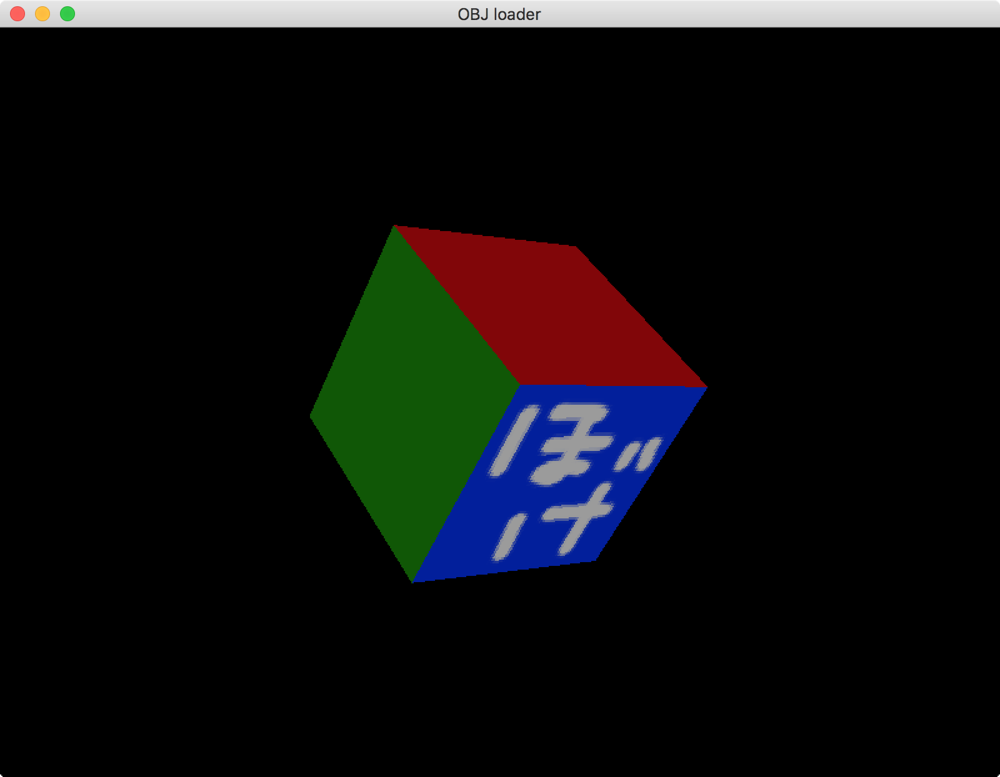

# Wavefront OBJ loader with OpenGL 1.1

## 概要
OpenGL 1.1 の学習向けにOBJ形式のファイルを読み込むサンプル。type1〜type5まで徐々に複雑になっていっています。

+ type1

  頂点座標のみ対応

+ type2

  頂点座標＋法線ベクトル
  
+ type3

  頂点座標＋法線ベクトル＋テクスチャ座標
  
+ type4

  頂点座標＋法線ベクトル＋mtlファイル
  
+ type5

  頂点座標＋法線ベクトル＋テクスチャ座標+mtlファイル

## 利用した外部ライブラリ
+ OpenGL 1.1
+ GLFW 3.2.1
+ GLEW
+ stb_image 2.14

## License
License All source code files are licensed under the MPLv2.0 license

[MPLv2.0](https://www.mozilla.org/MPL/2.0/)
